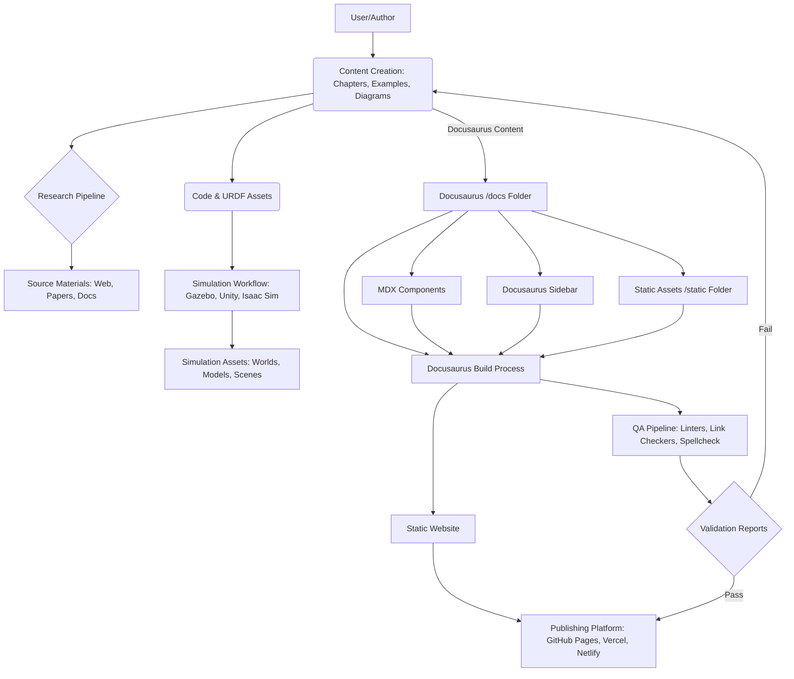

# Implementation Plan: Physical AI & Humanoid Robotics Book

**Branch**: `1-robotics-book-spec` | **Date**: 2025-12-06 | **Spec**: D:\Quarter 4\ai-book\humanoid-robotic-book\specs\1-robotics-book-spec\spec.md
**Input**: Feature specification from `/specs/1-robotics-book-spec/spec.md`

**Note**: This template is filled in by the `/sp.plan` command. See `.specify/templates/commands/plan.md` for the execution workflow.

## Summary

This plan outlines the implementation strategy for creating an authoritative handbook on Physical AI and Humanoid Robotics, published as a Docusaurus website. The approach focuses on a research-concurrent workflow, ensuring engineering accuracy, reproducible simulations, and comprehensive quality validation.

## Technical Context

**Language/Version**: Node.js (for Docusaurus), Python 3.x (for ROS2, FastAPI, VLA scripts)
**Primary Dependencies**: Docusaurus, ROS2, Gazebo, Unity, NVIDIA Isaac Sim, FastAPI, Whisper, LLMs
**Storage**: Local filesystem for Docusaurus content (Markdown/MDX files, static assets)
**Testing**: Jest/React Testing Library (for MDX components), pytest (for Python examples), custom scripts for URDF/simulation validation, Docusaurus built-in testing (link checker, build test)
**Target Platform**: Web (Docusaurus static site), Linux (ROS2, Gazebo, Isaac Sim, FastAPI)
**Project Type**: Hybrid (documentation site with embedded code examples and simulation assets)
**Performance Goals**: Fast loading Docusaurus site, responsive embedded simulations/demos
**Constraints**: 500-1500 words per chapter, APA citation style, Grade 10-12 readability, consistent safety rules, short code examples.
**Scale/Scope**: Single book (4,000-6,000 words), covering 4-6 core modules of embodied AI and humanoid robotics.

## Constitution Check

*GATE: Must pass before Phase 0 research. Re-check after Phase 1 design.*

- **Core Principles**: Alignment with engineering accuracy, academic clarity, verified/reproducible workflows, safety-first, ethical AI, and alignment with official documentation. (PASS)
- **Standards**: Verifiable claims, APA/IEEE citations, 30% peer-reviewed sources, 0% plagiarism, Grade 10-12 readability, accurate diagrams/code. (PASS)
- **Constraints**: Length (4,000-6,000 words), minimum 12 authoritative sources, PDF/Markdown formats, required diagrams/content (robot system architecture, sensor-AI-controller-actuator flow, safety guidelines, simulation setup+validation). (PASS)
- **Success Criteria**: Defines complete workflow, maps tools to responsibilities, ensures reproducibility/safety/ethics, clear team workflow, passes mentor audit. (PASS)
- **Scope**: Covers all hackathon focus areas. (PASS)
- **System Requirements**: Specifies hardware for digital twin workstation and edge kit, sensors, robots, cloud usage. (PASS)
- **Team Workflow Rules**: ROS 2 packages, URDF/SDF models, Unity for visualization, Isaac Sim for data+perception, VLA pipeline, Simulation -> Testing -> Deployment -> Safety Check. (PASS)
- **Ethics & Safety**: No unsafe movements, E-Stop, cloud latency independence, real-world test safety, explainable AI. (PASS)
- **Versioning**: Semantic Versioning, version history table. (PASS)
- **Chapter Rules**: Each chapter contains title, objectives, concepts, deep dive, code/pseudocode, diagrams, safety notes, assignments, references. (PASS)
- **Deliverables**: Final Constitution, System architecture diagram, Simulation validation report, AI perception+planning pipeline, Capstone functional spec. (PASS)
- **Completion Definition**: All sections technically accurate, safety rules included, pass mentor audit. (PASS)

## Project Structure

### Documentation (this feature)

```text
specs/1-robotics-book-spec/
├── plan.md              # This file (/sp.plan command output)
├── research.md          # Phase 0 output (/sp.plan command)
├── data-model.md        # Phase 1 output (/sp.plan command)
├── quickstart.md        # Phase 1 output (/sp.plan command)
├── contracts/           # Phase 1 output (/sp.plan command)
└── tasks.md             # Phase 2 output (/sp.tasks command - NOT created by /sp.plan)
```

### Source Code (repository root)

```text
.
├── docs/                      # Docusaurus documentation content
│   ├── intro.md
│   ├── robotics-fundamentals/ # Phase: Foundation
│   │   ├── chapter1-physical-ai.mdx
│   │   └── chapter2-embodied-intelligence.mdx
│   ├── ros2-nervous-system/   # Phase: Analysis
│   │   ├── chapter3-ros2-nodes.mdx
│   │   └── chapter4-ros2-communication.mdx
│   ├── simulation-digital-twin/ # Phase: Analysis
│   │   ├── chapter5-gazebo-unity.mdx
│   │   └── chapter6-isaac-sim.mdx
│   ├── vla-pipelines/         # Phase: Synthesis
│   │   ├── chapter7-whisper-llm.mdx
│   │   └── chapter8-ros2-actions.mdx
│   └── capstone-humanoid/     # Phase: Synthesis
│       └── chapter9-autonomous-workflow.mdx
├── static/                    # Docusaurus static assets (images, diagrams)
├── src/                       # Docusaurus theme customization (MDX components)
│   ├── components/
│   │   ├── Diagram.js
│   │   └── CodeExample.js
│   └── css/
├── sidebars.js                # Docusaurus sidebar configuration
├── docusaurus.config.js       # Docusaurus main configuration
├── research/                  # Research materials and notes (e.g., PDFs, web links)
├── code-examples/             # Standalone code examples (Python, URDF)
│   ├── ros2-pkg/
│   ├── urdf-models/
│   └── fastapi-demo/
├── simulations/               # Simulation assets (Gazebo worlds, Unity projects, Isaac Sim scenes)
│   ├── gazebo-worlds/
│   ├── unity-projects/
│   └── isaac-sim-scenes/
└── .github/workflows/         # CI/CD pipelines
    ├── docusaurus-build.yml
    └── quality-checks.yml
```

**Structure Decision**: The project will adopt a monorepo structure where the Docusaurus documentation site lives at the root, alongside `research/`, `code-examples/`, and `simulations/` directories to support the book's content. Docusaurus will manage the `/docs` content, `static` assets, and `src` for custom MDX components.

## Complexity Tracking

> **Fill ONLY if Constitution Check has violations that must be justified**

| Violation | Why Needed | Simpler Alternative Rejected Because |
|-----------|------------|-------------------------------------|
| N/A | N/A | N/A |

### 1. Architecture Sketch

- **Architectural Components**:
    - **Content Layer**: Chapters, Examples (code-examples/), Diagrams (static/), Workflows.
    - **Research Pipeline**: `research/` directory, WebSearch, WebFetch, academic databases.
    - **Simulation Workflow**: `simulations/` directory (Gazebo, Unity, Isaac Sim assets), `code-examples/` for integration scripts.
    - **Code/URDF Assets**: `code-examples/` for ROS2 packages, URDF models, FastAPI demos.
    - **Docusaurus Architecture**:
        - `/docs` folder structure: Organized by phases (e.g., `docs/foundation/`, `docs/analysis/`, `docs/synthesis/`).
        - `sidebar.js`: Configured to reflect the book's section and chapter structure.
        - Versioning strategy: Initial release will not use Docusaurus versioning; future updates will consider it for major revisions.
        - `static/` assets: Images, GIFs, video files for diagrams and simulation results.
        - MDX components: Custom React components in `src/components/` for enhanced diagrams, interactive code examples, and citation management.
    - **QA and Publishing Pipeline**:
        - Docusaurus build: `npm run build` to generate static site.
        - Deployment: GitHub Pages or Vercel/Netlify integration for automated deployment.
        - QA checks: Integrated into CI pipeline.

### 2. Section Structure

- **Major Book Sections (Organized by Constitution Phases)**:
    - **Research Phase**:
        - `docs/research-intro.md`: Introduction to the book and research methodology.
        - `research/`: External research notes, articles, and links.
    - **Foundation Phase**:
        - `docs/foundation/chapter1-physical-ai-fundamentals.mdx`
        - `docs/foundation/chapter2-embodied-intelligence.mdx`
    - **Analysis Phase**:
        - `docs/analysis/chapter3-ros2-nervous-system.mdx`
        - `docs/analysis/chapter4-ros2-communication-patterns.mdx`
        - `docs/analysis/chapter5-gazebo-unity-digital-twin.mdx`
        - `docs/analysis/chapter6-nvidia-isaac-sim-ecosystem.mdx`
    - **Synthesis Phase**:
        - `docs/synthesis/chapter7-vision-language-action-pipelines.mdx`
        - `docs/synthesis/chapter8-capstone-autonomous-humanoid.mdx`
    - **Review & Polish Phases**: Integrated into overall content refinement.
    - **Release Phase**: Publishing final Docusaurus site.
- **Research links and cross-references via MDX**: Use custom MDX components for consistent citation rendering and internal linking.

### 3. Research Approach

- **Research-Concurrent Workflow**: Research will be conducted iteratively alongside writing.
    - Initial broad research for outlining.
    - Targeted research for specific technical deep dives during chapter writing.
    - Continuous validation of claims against sources.
- **APA Citation Style**: All citations will follow APA guidelines.
- **Markdown/MDX-compatible citations**: Custom MDX components will be developed for rendering citations (e.g., `<Citation source="[Author, Year]" />`).
- **Source reliability rules**: Prioritize official documentation (ROS2, Isaac, Docusaurus), peer-reviewed academic papers, and reputable industry blogs. Avoid Stack Overflow as primary source.
- **Citation validation**: Automated checks (CI) for valid citation format and presence of cited sources in a bibliography section (or a dedicated `references.mdx` file).

### 4. Quality Validation

- **Acceptance criteria**:
    - **Content**: Engineering accuracy (SC-002), Grade 10-12 readability (SC-004), 500-1500 words/chapter (SC-006), clear theory-simulation-real-world connection (SC-005).
    - **Code**: Examples are functional, match explanations, and are reproducible.
    - **Diagrams**: Clear, visually accurate, enhance understanding (SC-003).
    - **Simulations**: Reproducible results, match described behaviors.
- **Plagiarism checks**: Manual and automated (if tool available) checks for content originality.
- **Readability checks**: Automated tools (e.g., Flesch-Kincaid grade level via CI).
- **APA validation**: Custom script or linter for citation format.
- **Simulation reproducibility tests**: Scripts to run simulations and verify expected outputs/logs.
- **CI pipeline (`.github/workflows/quality-checks.yml`)**:
    - **Markdown lint**: `markdownlint-cli` for style and formatting.
    - **Broken link checker**: Docusaurus built-in or `lychee` for internal and external links.
    - **Sidebar validation**: Script to ensure all `/docs` files are referenced in `sidebars.js` and there are no broken references.
    - **Docusaurus build test**: `npm run build` to ensure successful static site generation.
    - **Spellcheck**: `cSpell` or similar.
    - **PDF build from Markdown**: `pandoc` or Docusaurus PDF export plugin (if available).

### 5. ADRs (Architectural Decision Records)

- **ROS2 version**:
    - *Options*: ROS2 Humble (LTS), ROS2 Iron (latest).
    - *Trade-offs*: Stability vs. latest features. Humble is mature and widely supported; Iron offers newer capabilities but might have less community support currently.
- **Simulation tools**:
    - *Options*: Gazebo, Unity, NVIDIA Isaac Sim.
    - *Trade-offs*: Gazebo (open-source, ROS2 integration), Unity (rich visualization, game development tools), Isaac Sim (NVIDIA ecosystem, hardware-accelerated, highly accurate physics).
- **Docusaurus repo structure**:
    - *Options*: Monorepo (Docusaurus at root with examples/sims), separate repos.
    - *Trade-offs*: Monorepo simplifies local development and content integration but can become large. Separate repos offer modularity but add overhead for cross-repo linking and CI.
- **MDX vs Markdown**:
    - *Options*: Pure Markdown, MDX for enhanced components.
    - *Trade-offs*: Pure Markdown is simpler but limits interactivity. MDX allows rich React components but adds complexity.
- **Code block formatting and style guide**:
    - *Options*: Prettier, ESLint, custom Markdown formatting rules.
    - *Trade-offs*: Consistency vs. overhead. Automated tools ensure compliance but require setup.
- **Publishing platform**:
    - *Options*: GitHub Pages, Vercel, Netlify.
    - *Trade-offs*: GitHub Pages is free and integrated with GitHub. Vercel/Netlify offer more features (previews, serverless functions) but might have cost implications for large projects.
- **Backend demo choice**:
    - *Options*: FastAPI, Flask, Node.js (Express).
    - *Trade-offs*: FastAPI (modern Python, high performance), Flask (minimalist Python), Express (JavaScript ecosystem, suitable if Node.js is already in use for Docusaurus).
- **Node.js usage**:
    - *Options*: Docusaurus only, or for backend demos too.
    - *Trade-offs*: Limiting Node.js to Docusaurus reduces toolchain complexity. Using it for backend demos provides consistency if developers are already proficient.

### 6. Testing Strategy

- **Verification for**:
    - **Code examples**: Automated execution where possible (e.g., pytest for Python scripts), manual verification for complex ROS2/simulation examples.
    - **URDF files**: Validation against URDF schema, loading into Gazebo/Isaac Sim to check visual and physical properties.
    - **Simulation worlds**: Launching worlds in simulators and running simple tests (e.g., robot movement, sensor data capture) to confirm functionality.
    - **Chapter cross-links**: Docusaurus built-in link checker.
    - **Docusaurus sidebar integrity**: Script to check `sidebars.js` for completeness and correct file paths.
    - **APA citation completeness**: Custom script to ensure all in-text citations have corresponding entries in `references.mdx`.
- **Publishing verification**:
    - **Docusaurus static site build**: CI pipeline includes `npm run build` to detect build errors.
    - **PDF/EPUB export tests**: Manual verification of generated PDF/EPUB quality, formatting, and content integrity using `pandoc` or a Docusaurus plugin.

### 7. Dependencies

- **Workflow Dependencies**:
    - **Research → Draft**: Research findings inform chapter drafting.
    - **Draft → Verification**: Drafted content needs technical verification (code, simulations, diagrams).
    - **Verification → QA**: Verified content undergoes quality assurance (readability, plagiarism, APA).
    - **QA → Publish**: QA-approved content is prepared for publishing.
- **Blocking Dependencies**:
    - Simulation assets (URDF, world files) are blocking for chapters that require running and explaining simulations.
    - Core Docusaurus setup and initial configuration must be complete before content creation.
    - Custom MDX components are blocking for chapters that rely on enhanced interactive elements.
- **Non-blocking Dependencies**:
    - Backend demo choices (FastAPI) can be developed in parallel with main content, integrated later.
    - Detailed CI/CD setup can be refined iteratively.
- **Toolchain Constraints**:
    - **Node.js**: Strictly for Docusaurus development and build processes.
    - **FastAPI**: Optional, for specific backend demos if chosen.
    - **ROS2 + Isaac Sim**: Required for robotics workflows and advanced simulations; requires Ubuntu environment.

### 8. Implementation Phases

- **Research Phase**:
    - *Outputs*: `research.md` (consolidated findings), updated knowledge base, initial content outlines.
    - *Deliverables*: Comprehensive research notes on Physical AI, ROS2, simulation tools, VLA, and humanoid robotics.
- **Foundation Phase**:
    - *Outputs*: `docs/foundation/*.mdx` chapters (Physical AI fundamentals, embodied intelligence), initial Docusaurus setup.
    - *Deliverables*: Operational Docusaurus site with basic structure, two foundational chapters, `sidebars.js` configured for these chapters.
- **Analysis Phase**:
    - *Outputs*: `docs/analysis/*.mdx` chapters (ROS2, Gazebo/Unity, Isaac Sim), `code-examples/` (ROS2 packages, URDFs), `simulations/` (Gazebo/Isaac scenes).
    - *Deliverables*: Chapters explaining ROS2 and simulation tools, functional code examples, reproducible simulation environments.
- **Synthesis Phase**:
    - *Outputs*: `docs/synthesis/*.mdx` chapters (VLA pipelines, capstone), `code-examples/` (FastAPI demos, VLA scripts).
    - *Deliverables*: Chapters on advanced VLA systems and autonomous humanoid workflow, working VLA pipeline demo.
- **Review Phase**:
    - *Outputs*: Peer review feedback, mentor technical audit report.
    - *Deliverables*: Consolidated feedback report, action plan for revisions.
- **Polish Phase**:
    - *Outputs*: Revised content, updated diagrams, final code examples, completed quality checks (plagiarism, readability).
    - *Deliverables*: Polished Docusaurus content, passing CI quality gates.
- **Release Phase**:
    - *Outputs*: Built static site, deployed to hosting platform, generated PDF/EPUB.
    - *Deliverables*: Publicly accessible Docusaurus website, downloadable book in multiple formats.

### Architecture Sketch



This plan aligns with the specified business goals and the full book specification, ensuring Docusaurus compatibility and a structured development process.
